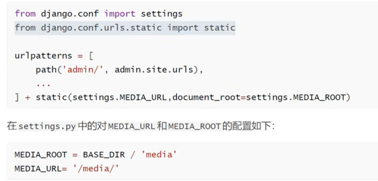

# Django 项目练习

+ python
  + 使用虚拟环境，避免和本机上python冲突，导致pip下载依赖失败

+ 项目启动方式
  + 项目根路径下执行命令: python .\manage.py runserver
  + pycharm中运行


+ 项目结构
  + manage.py
    > python manage.py [子命令]
  + settings.py
  + urls.py
  + wsgi.py


+ 创建app
  > python manage.py startapp [app名]


+ 视图函数
  + 通常写在各app的**views.py**中

+ query string 获取
  + views.py
    ```python
    from django.shortcuts import HttpResponse
    
    def book_detail_query_str(request):
        book_id = request.GET.get('id')
        return HttpResponse(f"您查找的图书id是: {book_id}")
    ```
  + urls.py
    ```python
    from django.urls import path
    from book import views
    
    urlpatterns = [
        path("book", views.book_detail_query_str),
    ]
    
    ```

+ path传参
  ```
  def book_detail_path(request, book_id):
      return HttpResponse(f"您查找的图书id是: {book_id}")
  
  path("book/<book_id>", views.book_detail_path),
  ```
  + 可以给参数指定类型
    + path("book/<int\:book_id>", views.book_detail_path)
    + 会校验
    + str
      + 不能包含斜杠
    + slug
      + 由英文横杠-，或者下划线_连接英文字符或者数字而成的字符串
    + uuid
    + path
      + 匹配非空的英文字符串，可以包含斜杠/

+ path函数的view参数
  + 可以为一个视图函数或者 类视图.as_view()或者django.urls.include()函数的返回值


+ url反转


+ 渲染模版
  + 方式一
    ```python
    from django.template.loader import render_to_string
    from django.http import HttpResponse
    def book_detail(request, book_id):
        html = render_to_string("detail.html")
        return HttpResponse(html)
    ```
  + 方式三
    ```python
    from django.shortcuts import render
    def book_list(request):
        return render(request, "list.html")
    ```


+ html中使用静态文件
  + 方式一(.html文件中)
    > 
  + 方式二(settings.py)
    > 'builtins': ['django.templatetags.static']


+ 直接访问静态文件（上传的文件）
  


